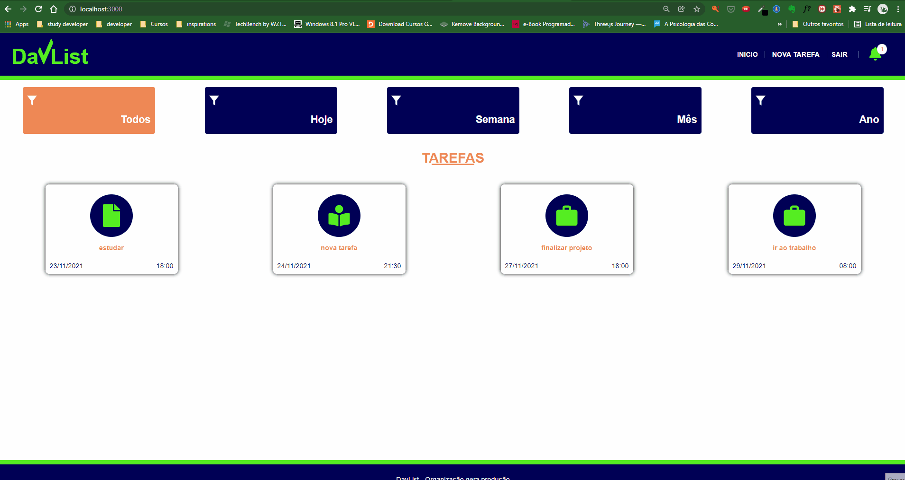

<h1 align="center">
React-DayList
</h1>

<p align="center">
  <a href="https://www.linkedin.com/in/leonascimentopro/">
      
  </a>
</p>



## 🚀 Sobre o Projeto

Projeto de lista de tarefas criada com React e comsumindo uma API própria desenvolvida com NodeJS e utilizando o MongoDB, o projeto também tem um [versão app](https://github.com/leonascimeto/react-native-daylist) que deve ser utilizado para informar o código do dispositivo através do qrCode, o projeto é baseado em um curso de react e react native.

### 🛠 Tecnologias

As seguintes ferramentas foram usadas na construção do projeto:

- [React](https://pt-br.reactjs.org/)
- [styled-components](https://styled-components.com/)
- [react-router-dom](https://v5.reactrouter.com/web/guides/quick-start)
- [axios](https://www.npmjs.com/package/axios)
- [Tippy.js](https://atomiks.github.io/tippyjs/)
- [date-fns](https://date-fns.org/)
- [babel](https://babeljs.io/)

### Features

- [x] integração com versão app
- [x] consumo de api com axios
- [x] tela de listagem de tarefas com filtro
- [x] icone de notificação de tarefas atrasadas
- [x] scanner de qrcode
- [x] tips dos tipos de tarefas

## 🚀 Como rodar este projeto

- Para clonar e executar este aplicativo, você precisará de [Git](https://git-scm.com), [MongoDB](https://www.mongodb.com/) e [NodeJs][nodejs] Instalados em seu computador.
- Necessário executar API do projeto, segue o link do repositório: [API DAYLIST](https://github.com/leonascimeto/node-daylist).
- o arquivo src/services/api.js a contante baseURL deve ser alterada para o IP da rede local.


### 🌀 Clonando o repositório

```bash
# Clone este repositório
$ git clone https://github.com/leonascimeto/react-daylist.git

# Acesse a pasta do projeto no terminal/cmd
$ cd react-daylist
```

### 🧭 Rodando a aplicação web

```bash
# Instale as dependências
$ npm install

# Execute a Aplicação
$ npm start

```

Use a versão app para ler o qrCode, um alerta com a informação do ID do smartphone será renderizado, digite o id no campo para ter acesso as funcionalidades da versão web.

#

Desenvolvido por Leonardo Fernandes 👨‍💻 [Entre em contato!](https://www.linkedin.com/in/leonascimentopro/)
